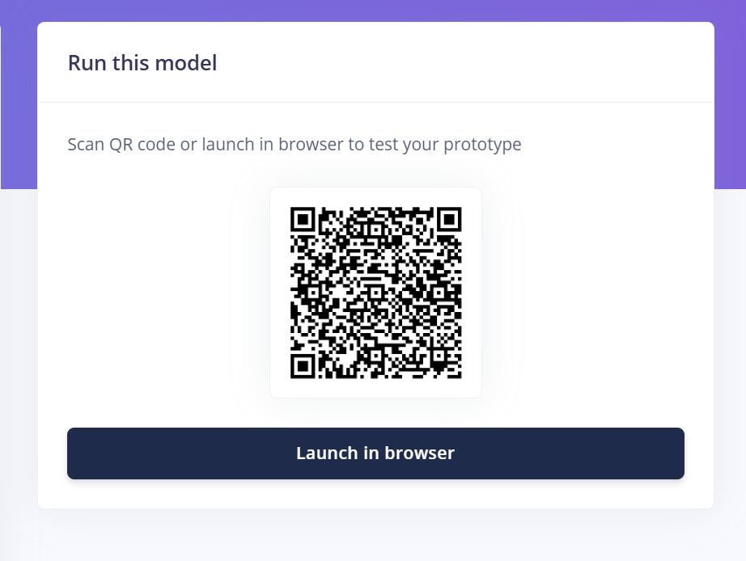
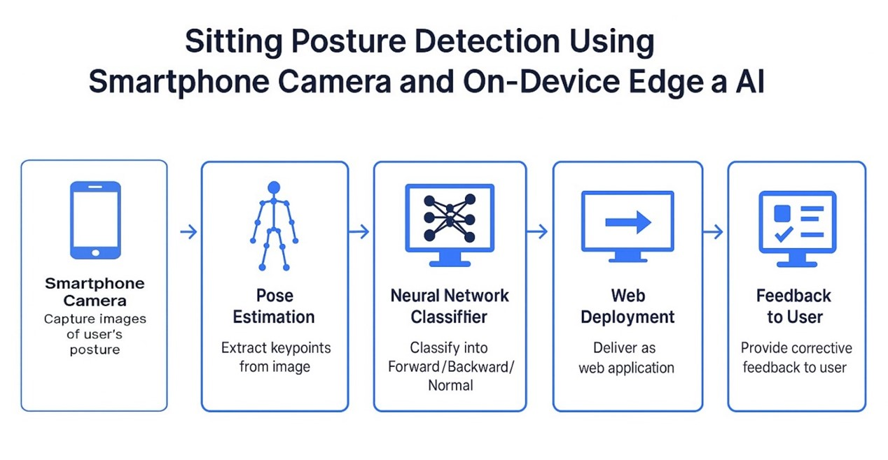
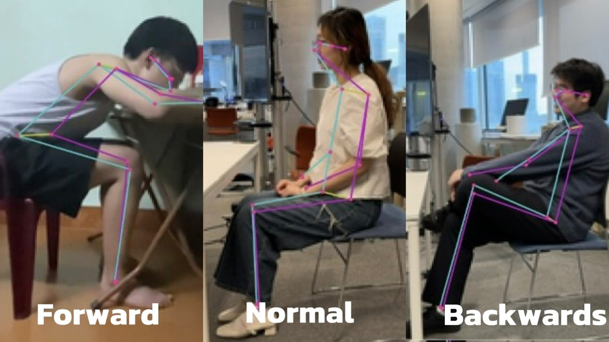

# 📐 Let Me See — Sitting Posture Detection

A lightweight AI-powered system for classifying sitting posture (Forward / Backwards / Normal) in real-time using only a smartphone camera. Built with [Edge Impulse](https://www.edgeimpulse.com/) and deployed as a mobile browser app, it runs fully on-device — no extra hardware or cloud needed.

---

## 🚀 How It Works

1. 📸 **Capture**: Users take images of themselves in seated positions using a smartphone.
2. 🧍‍♂️ **Pose Estimation**: Keypoints are extracted using a custom [processing block](https://github.com/edgeimpulse/pose-estimation-processing-block).
3. 🧠 **Classification**: A fully connected neural network classifies posture into:
- **Forward**: >15° lean with neck flexion  
- **Backward**: >25° recline with chair contact  
- **Normal**: Vertically aligned spine (±5°)

4. 🌐 **Deployment**: Model is exported as WebAssembly and runs in a mobile browser via QR code.




---

## 🧠 Model Architecture

- Input: 51 features (17 keypoints × x, y, confidence)
- Hidden Layers: Dense(40, ReLU) → Dense(20, ReLU)
- Output: Softmax(3) → [Forward, Backward, Normal]

---

## 📷 Example Output


*Figure. System overview: data flow from image to prediction.*


*Figure. Example of pose estimation on labeled image.*

---


## 📂 Project Structure

```bash
📁 Assets/images                  # Diagrams and screenshots
📁 model/                # Trained Edge Impulse model files
📄 README.md             # This file
📄 Let_Me_See_Report.md  # Full academic report (optional)
```
---

## 🔗 References

- 📌 Custom Pose Estimation Block (Edge Impulse):  
  https://github.com/edgeimpulse/pose-estimation-processing-block  
- 📄 Full Report: [Let_Me_See_Report.md](./Let_Me_See_Report.md)
- 📚 Based on:  
  Banbury et al., “Benchmarking TinyML Systems”, DAC 2020  
  TensorFlow MoveNet (2022): https://www.tensorflow.org/hub/tutorials/movenet  
  Chu, H.Q. (2024). Kaggle Dataset: https://www.kaggle.com/datasets/huyquangchu/test-dataset

---

## 👤 Author

Created by Trista — for CASA0018 Intelligent Environments (UCL)  
📅 Date: April 2025  
🔖 License: MIT
