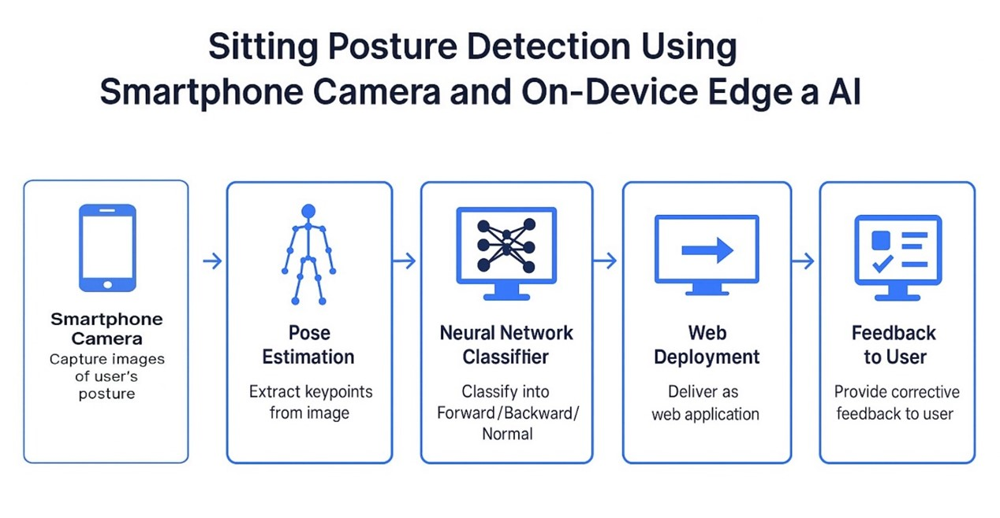

# Let Me See — A Sitting Posture Detection Model

Author: Zinan Ye 
GitHub Repo: [https://github.com/TTrista/Let-Me-See]
Edge Impulse Project: [https://studio.edgeimpulse.com/studio/644292]  

## Introduction

This project presents a mobile-based sitting posture detection system that classifies the user's posture into three categories: **Forward**, **Backward**, and **Normal**. The system is implemented using the Edge Impulse platform and leverages pose estimation to extract keypoints from camera images. A lightweight neural network model is used for real-time classification, running entirely on-device via a mobile browser. 

The motivation behind the project stems from the observation that many students and office workers unknowingly adopt poor sitting postures during prolonged screen time. These positions, while seemingly comfortable, may lead to reduced focus or long-term musculoskeletal strain. Inspired by open-source tools like MoveNet and TinyML applications, the project aims to bring lightweight AI into everyday health-related use cases without requiring additional hardware.

*Figure 1 — Application Workflow Diagram*

## Research Question

How can a mobile-based system, without relying on any external hardware, use the phone’s camera and edge AI to perform real-time detection and classification of sitting posture?

## Application Overview

The system consists of five main components: **data acquisition**, **pose estimation**, **classification**, **on-device deployment**, and **user feedback**. Users manually capture images using a smartphone, ensuring their full body is within frame. These images are uploaded to the Edge Impulse platform, where a custom Docker-based pose estimation block extracts keypoints.

Each image is converted into a 51-dimensional feature vector based on the coordinates and confidence values of 17 human skeletal keypoints. These features are passed into a fully connected neural network classifier, which assigns a posture label. Once trained, the model is exported as a WebAssembly app and deployed via QR code access in a mobile browser. All inference is executed locally, ensuring privacy and low latency. Real-time results are visually presented to help users maintain healthier posture habits.

*Figure 2. Workflow of the sitting posture detection system.*

## Data

The dataset consists of 300 labeled images, divided into 82% training and 18% test data. 220 images were self-collected in varied indoor environments, capturing users in different clothing, lighting, and device angles. To balance demographic diversity, an additional 80 images were sourced from a public dataset on Kaggle [1].

Initially, a binary label scheme (Normal vs. Bad) was used, but proved too coarse. It was replaced with a three-class labeling: **Forward**, **Backward**, and **Normal**, defined as follows:

- **Forward**: Torso leans >15° forward, often with chin tucked toward the chest.
- **Backward**: Torso reclines >25° backward, typically in contact with a chair back or headrest.
- **Normal**: Upright posture with spine aligned vertically (±5° tolerance).

All images were manually reviewed for label accuracy. Pose estimation was performed through Edge Impulse, and any images with missing or poor-quality keypoints were removed. One example of a correctly labeled sample is shown below:

*Figure 3. Example of a labeled input image and its pose estimation overlay.*

## Model

The model architecture is a fully connected neural network (FCNN). It takes a 51-dimensional input derived from keypoint coordinates and confidence scores. The network includes two hidden layers with 40 and 20 neurons respectively, using ReLU activation, and a Softmax output layer that classifies the posture.

This structure was chosen for its simplicity and performance balance, supporting both accuracy and real-time execution. It was exported in WebAssembly format for in-browser deployment.

*Figure 4. Architecture of the fully connected neural network.*

## Experiments

Several experiments were conducted to improve the model through network and parameter tuning. The initial architecture (30-15 neurons) trained over 300 epochs quickly overfitted. Validation loss increased after epoch 70, while accuracy plateaued. Adjustments included reducing epochs to 60, lowering the learning rate to 0.002, and increasing network size to 40-20 neurons.

The label set was also changed from binary to three-class to enhance expressiveness. To address class imbalance, more Forward samples were added. These changes stabilized training and improved test accuracy to 81.5%.

*Figure 5. Final training setup and validation performance metrics.*

## Results and Observations

The final model achieved 90.0% accuracy on the training set and 81.5% on the test set. Performance was stable when skeletal keypoints were clear and backgrounds uncluttered.

Still, classification of **Forward** postures remained challenging. Its F1 score was lower than those of **Backward** and **Normal**, and misclassifications often occurred near the boundary between Forward and Normal. Feature Explorer visualizations showed clustering overlap in this region.

*Figure 6. Final testing set and validation performance metrics.*

These errors were likely caused by limited training samples, especially for borderline postures, and pose estimation errors when clothing matched the background. 

Future work may explore temporal modeling (multi-frame analysis), angle-based features, and adversarial augmentation to improve robustness and handle edge cases more effectively.

## Bibliography

1. Chu, H.Q. (2024). *test-dataset*. Kaggle. https://www.kaggle.com/datasets/huyquangchu/test-dataset  
2. TensorFlow Team. (2022). *MoveNet: Ultra-fast pose estimation model*. https://www.tensorflow.org/hub/tutorials/movenet  
3. Banbury, C. R., Reddi, V. J., Torelli, P., Holleman, J., Jeffries, N., Kiraly, C., & Moons, B. (2020). Benchmarking TinyML Systems: Challenges and Opportunities. In *DAC '20: Proceedings of the 57th ACM/IEEE Design Automation Conference*. https://doi.org/10.1109/DAC18072.2020.9218608

---

## Declaration of Authorship

I, Zinan Ye, confirm that the work presented in this assessment is my own. Where information has been derived from other sources, I confirm that this has been indicated in the work.

*Digitally signed:* 
**Assessment date:** [April 25, 2025]  
**Word count:** [1510]
